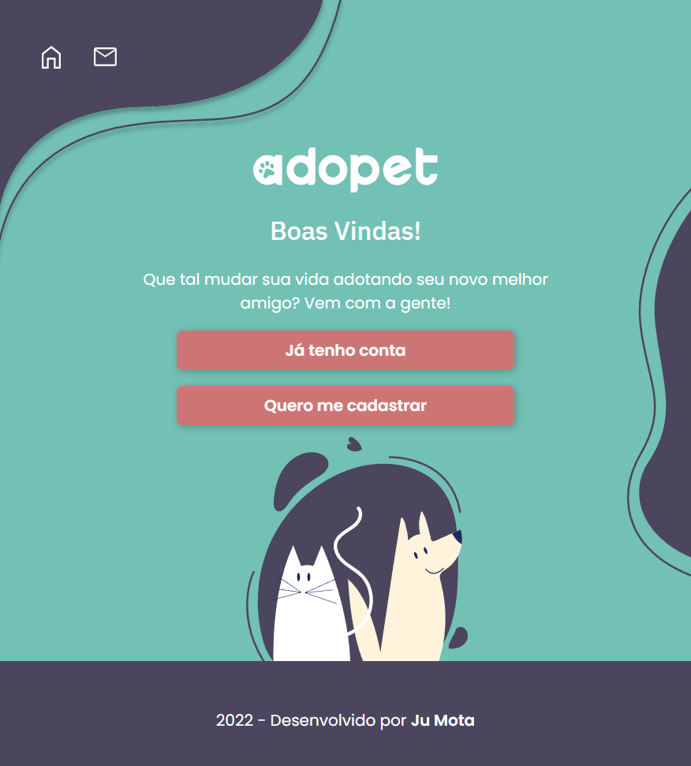

# _Alura Challenge Front-End 4 Edição_: Criando um site com a metodologia mobile-first :woman_technologist:

| :placard: Vitrine.Dev |     |
| ------------- | --- |
| :sparkles: Nome | **Adopet** 
| :label: Tecnologias | HTML, CSS 
| :rocket: URL | https://jumotac.github.io/AluraChallenge-Adopet/
| :fire: Desafio | https://www.alura.com.br/challenges/front-end-4?host=https://cursos.alura.com.br

## :cat:Sobre o Desafio AdoPet:dog:

Em 4 semanas vou desenvolver a versão das telas do usuário adotante para o site da AdoPet, que contará com página de login, cadastro, lista de pets e formulário de mensagem. 

[LINK PARA O PROJETO ORGINAL NO FIGMA](https://www.figma.com/file/TlfkDoIu8uyjZNla1T8TpH/Challenge---Adopet) 

#### - 01 semana:

**Criando um site:** Construir as telas iniciais como a home, login, cadastro e galeria de animais seguindo a metodologia mobile-first.

#### - 02 semana:

**Avançando no projeto:** Construir as telas de contato e de edição do usuário em todos os formatos. Também será construído o background das telas que é constituído de diferentes imagens.

#### - 03 e 4 semana:

**Telas dinâmicas:** Agora será a hora de tornar essas páginas estáticas (feitas somente com HTML e CSS) em páginas dinâmicas. Também fazer as validações dos formulários e permitir o cadastro e edição de usuário.

### :books:História:

A empresa AdoPet têm como objetivo fazer o intermédio entre adotantes de animais e ONGs que possuem foco de retirar animais da rua. Visando isso, ela precisa trazer mais usuários e aumentar a interação entre possíveis adotantes e representantes dessas ONGs e para isso, deseja implementar uma plataforma e levar a empresa pro mundo digital.

Para isso eles estão solicitando a nossa ajuda como desenvolvedores para criar o site e o ele deve conter os seguintes requisitos:

- Uma página inicial que será de login, contendo os botões de "já tenho conta" e "quero me cadastrar".
- Uma página de cadastro que terá um formulário solicitando as informações: nome, e-mail e senha.
- Uma página de login com um formulário de e-mail e senha.
- Uma página que deve aparecer após o login com uma lista de cachorros e gatos. Cada animal deve mostrar foto, nome, idade, porte, características e região. Para cada animal haverá um botão de contato.
- Uma página de edição de envio de mensagem, com um formulário com campos de nome, telefone, nome do animal e mensagem.
- Permitir a edição do perfil, onde também será possível incluir foto do usuário.

**É muito importante que o site seja responsivo para dar aos clientes a facilidade de comprar através de dispositivos mobiles.**

### :wrench:Ferramentas:

Ferramentas utilizadas para auxiliar na execução do projeto durante todo o challenge:

- **Trello** - para gerenciar o desenvolvimento do seu projeto.

- **Visual Studio Code** - editor de código

- **Github** - Para estruturar o portfólio 

  

### :heart:Agradecimentos:  

- Instrutores: 
  - [Mônica Mazzochi Hillman](https://www.linkedin.com/in/monicamhillman/);
  - [Antônio Evaldo](https://www.linkedin.com/in/antonio-evaldo/)
  - [Alura](www.alura.com.br)   

### :globe_with_meridians:Projeto Final: 

[LINK ADOPET - DESENVOLVIDO POR JU MOTA](https://jumotac.github.io/AluraChallenge-Adopet/) 

